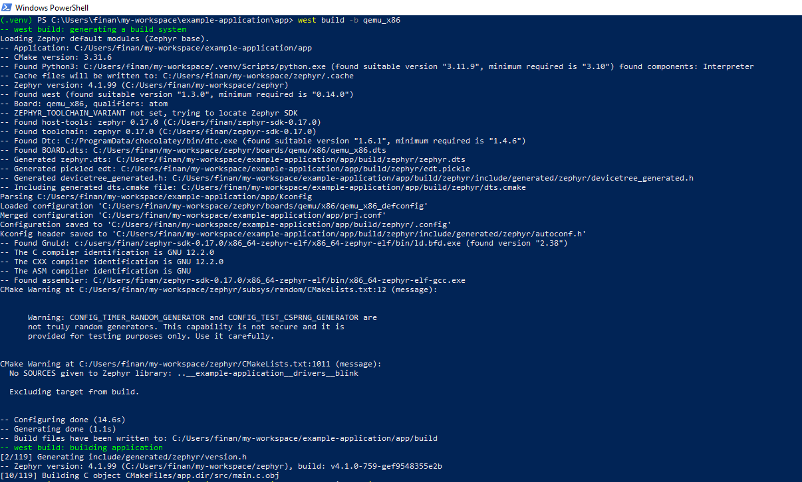
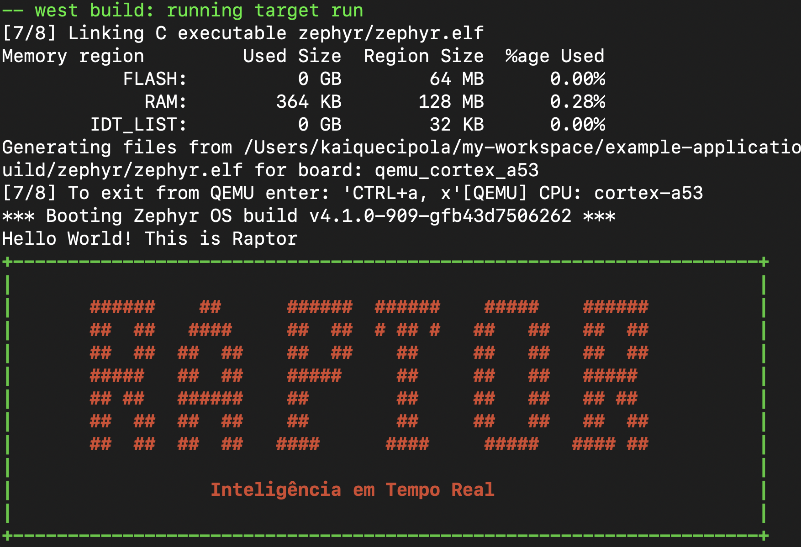

# CodeTest-Raptor
### Relatório Técnico: Implementação de um Projeto no Zephyr RTOS

---

#### **1. Introdução** 📄
Este relatório descreve a implementação de um projeto utilizando o Zephyr RTOS. O objetivo foi configurar o ambiente de desenvolvimento, compilar e executar a aplicação em um emulador QEMU, e exibir a mensagem determinada.

---

#### **2. Ferramentas e Bibliotecas Utilizadas** 🛠️
Foram utilizadas as seguintes ferramentas e bibliotecas:

1. **Zephyr RTOS**: Sistema operacional em tempo real para sistemas embarcados.
2. **West**: Ferramenta de gerenciamento de projetos Zephyr.
3. **QEMU**: Emulador de hardware para testar aplicações Zephyr.
4. **CMake**: Sistema de build para configurar e compilar projetos Zephyr.
5. **Python e Pip**: Para scripts de build e gerenciamento de dependências.
6. **Pyelftools**: Biblioteca Python para manipular arquivos ELF.
7. **Chocolatey**: Gerenciador de pacotes para instalar ferramentas.
8. **Ninja**: Sistema de build rápido e eficiente.
9. **Git**: Controle de versão para gerenciar o código-fonte.

---

#### **3. Configuração do Ambiente** ⚙️
O ambiente de desenvolvimento foi configurado seguindo os passos abaixo:

1. **Instalação do Chocolatey**:
   - Utilizado para instalar dependências como `cmake`, `ninja`, `qemu`, `python`, etc.

2. **Instalação do Zephyr SDK**:
   - Baixado e configurado o Zephyr SDK para suportar a arquitetura.

3. **Configuração do Ambiente Virtual Python**:
   - Criado um ambiente virtual para isolar as dependências do Python.

4. **Clonagem do Repositório Example-application e Zephyr**:
   - O repositório oficial do Zephyr foi clonado usando o comando `west init` e `west update`.

5. **Configuração das Variáveis de Ambiente**:
   - As variáveis `ZEPHYR_BASE` e `ZEPHYR_TOOLCHAIN_VARIANT` foram configuradas para integrar o Zephyr ao ambiente de desenvolvimento.

---

#### **4. Implementação do Projeto** 🔧
O projeto foi implementado seguindo os passos abaixo:

1. **Criação do Projeto**:
   - O código foi adicionado para exibir a mensagem "Hello Word! This is Raptor" no `app/src/main.c` dentro do `example-application`. 

2. **Compilação do Projeto**:
   - O comando `west build -b qemu_x86` foi utilizado para compilar o projeto.

3. **Execução no QEMU**:
   - O comando `west build -t run` foi utilizado para executar a aplicação no emulador QEMU.

4. **Personalização do Projeto**:
   - O arquivo `src/main.c` foi modificado para exibir a mensagem "Hello World! This is Raptor!".

---

#### **5. Dificuldades Encontradas** ⚠️
Durante a implementação do projeto, as seguintes dificuldades foram encontradas:

1. **Erro de Comando Desconhecido no West**:
   - O erro `unknown command "build"` ocorreu ao tentar compilar o projeto `example-application`. Foi resolvido inicializando o workspace com `west init -l .`.

2. **Erro de Arquivo PID no QEMU**:
   - O erro `cannot create PID file` ocorreu ao tentar executar o QEMU. Foi resolvido removendo o arquivo PID bloqueado e encerrando processos do QEMU em execução.

3. **Erro de Comando Desconhecido no CMake**:
   - O erro `Unknown CMake command "zephyr_syscall_include_directories"` ocorreu devido a um `CMakeLists.txt` incorreto. Foi resolvido corrigindo o arquivo `CMakeLists.txt`.

4. **Erro de QEMU Não Encontrado**:
   - O erro `QEMU-NOTFOUND` ocorreu ao tentar executar o projeto no QEMU. Foi resolvido instalando o QEMU e adicionando o caminho do executável ao `PATH` do sistema.

5. **Erro de Diretório Não Encontrado no `XDG_DATA_DIRS`**:
   - O aviso informando que `C:/msys64/mingw64/share` não estava nas variáveis de ambiente `XDG_DATA_HOME` e `XDG_DATA_DIRS` foi resolvido adicionando o caminho às variáveis de ambiente.

6. **Erro de Compilação e Execução no MSYS2**:
   - O QEMU funcionava apenas no terminal do MSYS2, mas não no terminal padrão do Windows. Foi resolvido adicionando o caminho do QEMU ao `PATH` do sistema.

7. **Erro de Conexão ao Clonar Repositórios**:
   - O erro `RPC failed; curl 18 transfer closed with outstanding read data remaining` ocorreu ao tentar clonar repositórios grandes, como o `hal_stm32`. Foi resolvido aumentando o buffer do Git e clonando manualmente o repositório.

---

#### **6. Conclusão** 🎉
O projeto foi implementado com sucesso no Zephyr RTOS, demonstrando a capacidade de configurar, compilar e executar aplicações em sistemas embarcados. As dificuldades encontradas foram superadas com a correção de configurações e a utilização adequada das ferramentas disponíveis.

O Zephyr mostrou-se uma plataforma robusta e flexível para desenvolvimento de sistemas embarcados, com suporte a uma ampla variedade de hardware e ferramentas de desenvolvimento.

---

#### **7. Referências** 📚
- Repositório oficial do Zephyr: [https://github.com/zephyrproject-rtos/zephyr](https://github.com/zephyrproject-rtos/zephyr)
- Documentação oficial do Zephyr: [https://docs.zephyrproject.org/](https://docs.zephyrproject.org/)
- Repositório `example-application`: [https://github.com/zephyrproject-rtos/example-application](https://github.com/zephyrproject-rtos/example-application)

---

## Print do Projeto em Funcionamento

---

